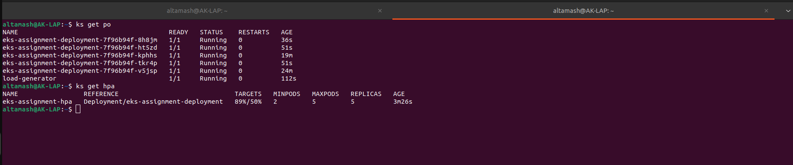

# EKS Assignment - Python Hello World App with Helm and GitHub Actions

This project sets up a complete CI/CD pipeline using GitHub Actions to deploy a simple Python Flask application to an AWS EKS cluster using Helm.

---

## Prerequisites

Before you begin, make sure the following are installed and configured:

- AWS CLI with access configured
- Terraform
- S3 bucket for storing Terraform state
- DynamoDB table for state locking

---

## Infrastructure Setup (Terraform)

All infrastructure code is located in the `infra/` directory.

### Note on Terraform Automation
Currently, Terraform provisioning is executed manually. To fully align with CI/CD best practices, automating infrastructure provisioning via GitHub Actions is a planned enhancement.


### Steps to Setup Infrastructure

1. **Create a new Terraform workspace**

   ```bash
   terraform workspace new dev

### Update Configuration Files

Before applying Terraform, ensure the following configuration updates are made:

1. **Edit `provider-and-backend.tf`**  
   - Update the backend block to point to your specific S3 bucket and DynamoDB table used for remote state and locking.

2. **Edit `terraform.dev.tfvars`**  
   - Fill in environment-specific values such as:
     - `vpc_cidr`
     - `region`
     - `cluster_name`
     - `environment`
     - Any other relevant variables

3. **Edit `locals.tf`**  
   - Add entries for your new environment. For example:
     ```hcl
     private_subnet_cidr = ["10.0.1.0/24", "10.0.2.0/24"]
     private_subnet_az   = ["us-east-1a", "us-east-1b"]
     public_subnet_cidr  = ["10.0.3.0/24", "10.0.4.0/24"]
     ```

### Run Terraform Commands

After updating the configuration files, run the following commands to deploy the infrastructure:

```bash
cd infra
terraform init
terraform plan --var-file=terraform.dev.tfvars
terraform apply --var-file=terraform.dev.tfvars
```

## Application Code

The application is a minimal Flask API.

**Location:** `code/`

- **app.py**  
  - `/` - Returns a JSON response: `"Hello World Test123"`  
  - `/healthz` - Returns HTTP 200 OK for health checks

- **requirements.txt**  
  Lists required Python packages (e.g., Flask)

- **Dockerfile**  
  Builds the Python app using a base Python image  
  Exposes the application on port 3000

---

## Helm Chart (`eks-assignment/`)

This folder contains the Helm chart used to deploy the application on EKS.

**Helm Templates:**

- `deployment.yaml` - Defines the Kubernetes Deployment object  
- `service.yaml` - Creates a LoadBalancer service  
- `hpa.yaml` - Configures a Horizontal Pod Autoscaler (HPA)  
- `values.yaml` - Parameterizes image, replica count, and resource limits

---
### Horizontal Pod Autoscaler in Action

The HPA scales pods based on CPU usage. Below is a sample output showing how it automatically scales up:

#### HPA Status & Metrics::




## Verify the Metrics Server is Running

Run these commands to verify the Metrics Server deployment and check node and pod metrics:

```bash
kubectl get deployment metrics-server -n kube-system
kubectl top nodes
kubectl top pods
```
Without the Metrics Server, the Horizontal Pod Autoscaler (HPA) will not function correctly.

For more information, see the [Kubernetes Metrics Server documentation](https://github.com/kubernetes-sigs/metrics-server).


## Kubernetes Metrics Server for HPA

The Horizontal Pod Autoscaler (HPA) relies on the Kubernetes Metrics Server to fetch resource usage metrics (CPU, memory) for scaling decisions.

**Important:** Before deploying HPA, ensure the Metrics Server is installed:

```bash
kubectl apply -f https://github.com/kubernetes-sigs/metrics-server/releases/latest/download/components.yaml
```

## GitHub Actions Workflow (`.github/workflows/`)

This GitHub Actions workflow automates the full CI/CD pipeline:

- Builds the Docker image from the Flask app  
- Pushes the image to Amazon ECR  
- Deploys the Helm chart to EKS

---

### GitHub Actions Workflow Explanation

This GitHub Actions workflow automates building and deploying the Python Flask app to an AWS EKS cluster whenever code is pushed to the `main` branch. The workflow performs these key steps:

1. **Checkout source code** — Pulls the latest code from the repository.
2. **Configure AWS credentials** — Authenticates to AWS using stored GitHub secrets.
3. **Login to Amazon ECR** — Logs into the Elastic Container Registry to allow pushing Docker images.
4. **Build and tag Docker image** — Builds the Docker image from the `code/` directory and tags it with the Git SHA and `latest`.
5. **Push Docker image to ECR** — Pushes the tagged images to the Amazon ECR repository.
6. **Setup kubectl** — Installs and configures `kubectl` CLI to interact with the Kubernetes cluster.
7. **Update kubeconfig** — Updates the kubeconfig file to point to the specified EKS cluster.
8. **Setup Helm** — Installs Helm, the Kubernetes package manager.
9. **Deploy using Helm** — Deploys or updates the Kubernetes deployment on EKS using the Helm chart in the `eks-assignment/` directory, setting the Docker image repository and tag dynamically.

This pipeline ensures a fully automated CI/CD process that builds the app, pushes the container image, and deploys it seamlessly to your Kubernetes cluster on every commit to the main branch.


## Accessing the Application

Once deployed, you can access the application using the ALB URL:

- **App Root:**  
  `http://a9765a056862343e699706edf056f313-691567469.us-east-1.elb.amazonaws.com/`

- **Health Check:**  
  `http://a9765a056862343e699706edf056f313-691567469.us-east-1.elb.amazonaws.com/healthz`

---

## Room for Improvement

Here are a few enhancements that can be made:

- Automate Terraform with GitHub Actions instead of running it manually  
- Use an Ingress Controller (e.g., ALB Ingress) instead of a LoadBalancer service  
- Adopt GitHub OIDC Role Assumption for AWS access instead of static secrets  
- Add unit tests and CI steps before building and deploying the app  
- Enable centralized logging and monitoring with AWS CloudWatch, Prometheus, and Grafana  
- Add validation and linting steps for Helm charts and Dockerfiles  
- Implement security best practices such as image scanning and least-privilege IAM roles
- Use Argo CD for GitOps-based continuous delivery and better deployment management


